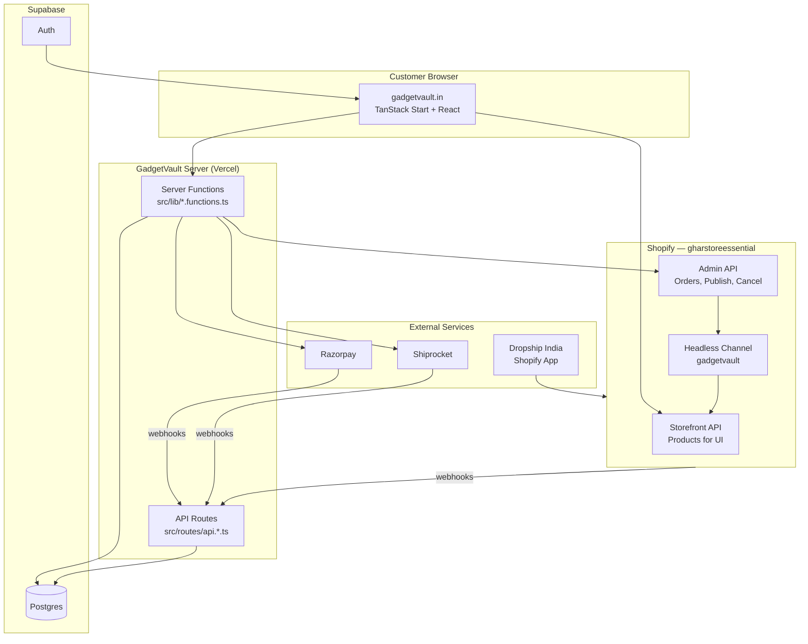
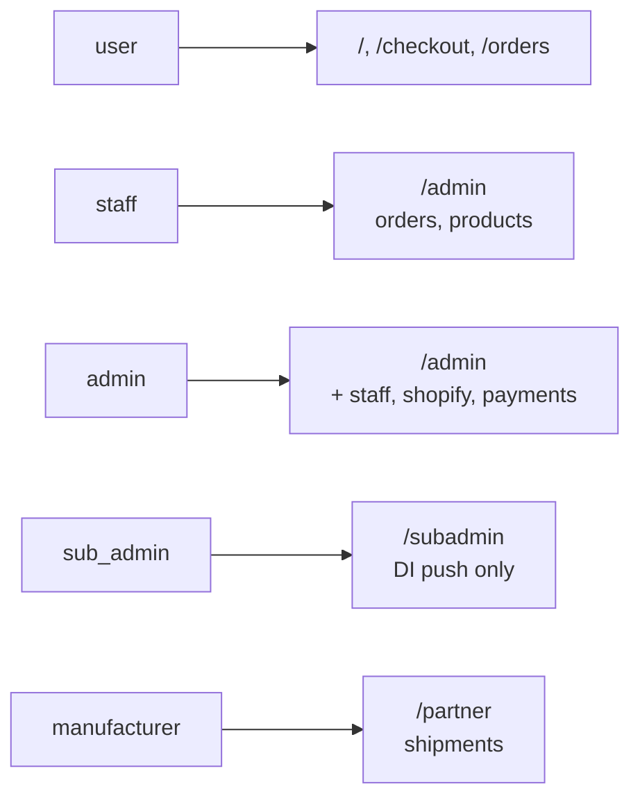
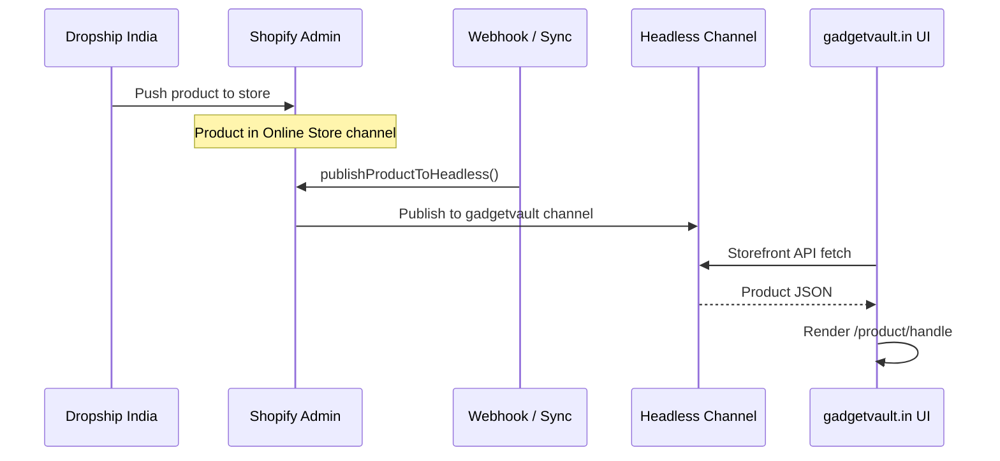
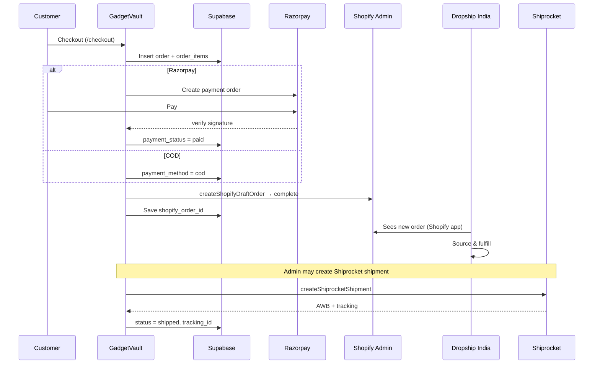
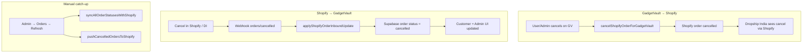
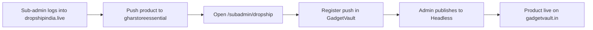
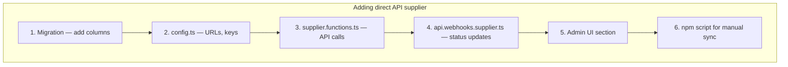
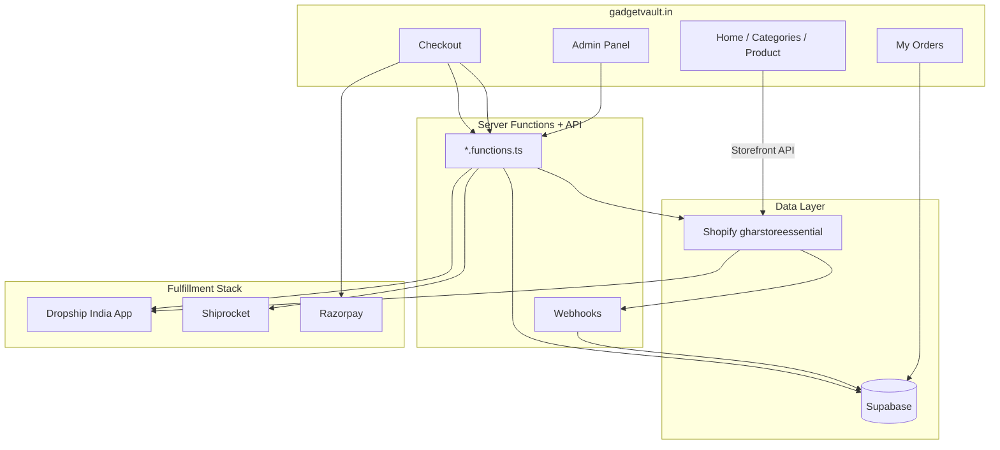

# GadgetVault — Developer Handoff Guide

Complete guide for any developer joining this project.  
**Store:** [gadgetvault.in](https://gadgetvault.in) · **Shopify store:** gharstoreessential.myshopify.com

---

## Table of contents

1. [What is this project?](#1-what-is-this-project)
2. [Architecture overview](#2-architecture-overview)
3. [Tech stack & folder structure](#3-tech-stack--folder-structure)
4. [Environment variables](#4-environment-variables)
5. [Local development setup](#5-local-development-setup)
6. [User roles & permissions](#6-user-roles--permissions)
7. [Product flow (Shopify Headless)](#7-product-flow-shopify-headless)
8. [Order flow (checkout → fulfillment)](#8-order-flow-checkout--fulfillment)
9. [Cancel & sync flow (GadgetVault ↔ Shopify)](#9-cancel--sync-flow-gadgetvault--shopify)
10. [Dropship India integration](#10-dropship-india-integration)
11. [How to add another supplier (like Dropship India)](#11-how-to-add-another-supplier-like-dropship-india)
12. [Webhooks reference](#12-webhooks-reference)
13. [Admin panels & routes](#13-admin-panels--routes)
14. [Key source files map](#14-key-source-files-map)
15. [npm scripts](#15-npm-scripts)
16. [Database schema (main tables)](#16-database-schema-main-tables)
17. [Deployment (Vercel)](#17-deployment-vercel)
18. [Common tasks cookbook](#18-common-tasks-cookbook)
19. [Troubleshooting](#19-troubleshooting)

---

## 1. What is this project?

GadgetVault is a **custom headless storefront**. Customers shop on `gadgetvault.in` (your UI). Behind the scenes:

- **Products** are loaded from **Shopify Storefront API** (Headless channel `gadgetvault`).
- **Orders** are saved in **Supabase**, then synced to **Shopify** as draft/final orders.
- **Dropship India** (Shopify app) picks up orders from Shopify and fulfills.
- **Shiprocket** handles shipping labels and tracking.
- **Razorpay** handles online payments and refunds.

```
┌─────────────────┐     ┌──────────────┐     ┌─────────────────┐
│  gadgetvault.in │────▶│   Supabase   │     │ Shopify Admin   │
│  (Custom UI)    │     │  orders,auth │◀───▶│ gharstoreessential│
└────────┬────────┘     └──────────────┘     └────────┬────────┘
         │                      ▲                      │
         │ Storefront API       │ Webhooks             │ Orders/Products
         └──────────────────────┼──────────────────────┘
                                │
                    ┌───────────┴───────────┐
                    │  Dropship India app   │
                    │  Shiprocket, Razorpay │
                    └───────────────────────┘
```

**Important:** GadgetVault UI does **not** replace Shopify Admin for inventory/fulfillment apps. Shopify is the **hub**; GadgetVault is the **customer-facing layer**.

---

## 2. Architecture overview



### Data ownership

| Data | Primary store | Also in |
|------|---------------|---------|
| Product catalog (live on site) | Shopify Headless | Fetched at runtime, not duplicated in Supabase |
| Product metadata (reviews, flash sale price) | Supabase | Overrides / supplements Shopify |
| Orders | Supabase | Mirrored to Shopify (`shopify_order_id`) |
| Users / auth | Supabase Auth | Profile in `profiles` table |
| Payments | Supabase `payments` | Razorpay dashboard |
| Shopify admin token | Supabase `app_settings` | Env fallback |

---

## 3. Tech stack & folder structure

```
design-stitch/
├── src/
│   ├── routes/              # Pages + API handlers (TanStack file-based routing)
│   │   ├── admin.*.tsx      # Admin panel pages
│   │   ├── subadmin.*.tsx   # Sub-admin (Dropship push) pages
│   │   ├── api.*.ts         # Webhooks + OAuth endpoints
│   │   ├── checkout.tsx     # Checkout flow
│   │   └── product.$slug.tsx
│   ├── lib/                 # Business logic
│   │   ├── *.functions.ts   # Server functions (API for frontend)
│   │   ├── shopify-order-inbound.ts
│   │   ├── order.functions.ts
│   │   └── razorpay-refund.ts
│   ├── integrations/
│   │   ├── shopify/         # Storefront + Admin API clients
│   │   └── supabase/        # DB client, auth middleware, types
│   └── components/          # React UI
├── scripts/                 # CLI tools (sync, publish, test)
├── supabase/migrations/     # SQL schema (run in order)
├── docs/                    # This documentation
├── shopify.app.toml         # Shopify Dev app config
├── vercel.json              # Production hosting
├── .env.example             # Template for local env
└── package.json
```

### Coding conventions

1. **Server logic** → `src/lib/<feature>.functions.ts` using `createServerFn`.
2. **Auth** → `.middleware([requireSupabaseAuth])` + role check inside handler.
3. **DB writes (admin)** → `supabaseAdmin` (service role) from `client.server.ts`.
4. **Shopify calls** → `src/integrations/shopify/admin.ts` or `storefront.ts`.
5. **Never** put secrets in `VITE_*` vars (they ship to browser).

---

## 4. Environment variables

Copy `.env.example` → `.env`. See [DEVELOPER_ACCESS_CHECKLIST.md](./DEVELOPER_ACCESS_CHECKLIST.md) for who provides each value.

| Variable | Where used | Required |
|----------|------------|----------|
| `VITE_SUPABASE_*` | Client auth | Yes |
| `SUPABASE_SERVICE_ROLE_KEY` | Server-only DB | Yes |
| `VITE_SHOPIFY_STORE_DOMAIN` | Product fetch | Yes |
| `VITE_SHOPIFY_STOREFRONT_TOKEN` | Storefront API | Yes |
| `SHOPIFY_CLIENT_ID/SECRET` | OAuth Admin API | Yes (prod) |
| `SHOPIFY_HEADLESS_PUBLICATION_ID` | Publish to Headless | Yes |
| `SHOPIFY_WEBHOOK_SECRET` | Webhook verify | Recommended |
| `VITE_APP_PUBLIC_URL` | OAuth, callbacks | Yes |
| `RAZORPAY_*` | Payments | If online pay enabled |
| `SHIPROCKET_*` | Shipping | Optional |
| `DROPSHIP_INDIA_PORTAL_URL` | Sub-admin link | Optional (has default) |

**Production canonical domain:** `https://gadgetvault.in` (hardcoded in `src/lib/shopify-oauth-config.ts` for OAuth).

---

## 5. Local development setup

```bash
# 1. Clone & install
git clone <repo>
cd design-stitch
npm install

# 2. Environment
cp .env.example .env
# Fill all required values (get from owner / vercel env pull)

# 3. Database
npm run db:setup      # apply migrations
npm run db:verify     # test connection

# 4. Run
npm run dev           # http://localhost:8080

# 5. Verify Shopify
npm run shopify:health
```

### Create local admin user

1. Sign up at `http://localhost:8080/auth`
2. In Supabase SQL editor:

```sql
INSERT INTO public.user_roles (user_id, role)
SELECT id, 'admin'::app_role FROM auth.users WHERE email = 'your@email.com';
```

3. Open `http://localhost:8080/admin`

---

## 6. User roles & permissions

Defined in `src/lib/auth-session.ts`, stored in `user_roles` table.



| Role | Panel | Can do |
|------|-------|--------|
| `user` | Shop | Browse, checkout, cancel own order (before packed) |
| `staff` | `/admin` | Manage orders, products, shipping |
| `admin` | `/admin` | Everything + Shopify OAuth, staff/sub-admin mgmt |
| `sub_admin` | `/subadmin` | Register Dropship India product pushes |
| `manufacturer` | `/partner` | Shiprocket for assigned orders |

**Auth middleware:** `src/integrations/supabase/auth-middleware.ts`  
**Client hook:** `useAuth()` from `src/lib/auth-context.tsx`

---

## 7. Product flow (Shopify Headless)

### Why Headless?

Shopify has many sales channels. GadgetVault only shows products published to the **Headless → gadgetvault** channel. Products in "Online Store only" (default from Dropship India) **will not appear** on the website until published to Headless.



### Three ways products reach the website

**A. Automatic (webhook)**  
Shopify `products/create` or `products/update` →  
`POST /api/webhooks/shopify/products` → auto-publish to Headless.

**B. Admin bulk sync**  
Admin → `/admin/shopify` → **Sync Everything**  
Or CLI: `npm run shopify:publish`

**C. Sub-admin (Dropship India) workflow**  
1. Sub-admin pushes on dropshipindia.live  
2. Registers push on `/subadmin/dropship`  
3. Admin reviews and publishes to Headless

### Key files

| File | Purpose |
|------|---------|
| `src/integrations/shopify/storefront.ts` | GraphQL queries for product list/detail |
| `src/integrations/shopify/publish.ts` | `publishProductToHeadless`, bulk publish |
| `src/lib/shopify-publish.functions.ts` | Admin "Sync all" server function |
| `src/routes/api.webhooks.shopify.products.ts` | Product webhook |
| `src/lib/category-map.ts` | Maps Shopify products → navbar categories |

### Navbar categories (auto-mapped)

Slugs: `kitchen-accessories`, `unique-gadgets`, `necessities`  
Mapped from product title, type, and collection — no manual tagging required.

---

## 8. Order flow (checkout → fulfillment)



### Step-by-step

1. **Checkout** (`src/routes/checkout.tsx`)  
   - Validates address (Zod)  
   - Creates row in `orders` + `order_items`  
   - Stores `shopify_variant_id` on each line item  

2. **Payment**  
   - Razorpay: `src/lib/razorpay.functions.ts`  
   - COD: no payment collection  

3. **Shopify sync** (`src/lib/shopify-order.functions.ts`)  
   - Creates draft order via Admin API  
   - Completes draft → real Shopify order  
   - Saves `shopify_order_id`, `shopify_draft_order_id` on order row  

4. **Fulfillment**  
   - Dropship India reads order from Shopify (automatic via Shopify app)  
   - Shiprocket: admin/manufacturer creates shipment (`src/lib/shiprocket.functions.ts`)  

5. **Status updates**  
   - Shiprocket webhook → `shipped` / `delivered`  
   - Shopify webhook → cancel / fulfillment status  

### Order statuses

`received` → `processing` → `shipped` → `delivered`  
Or: `cancelled` (customer/admin/Shopify)

Customer can cancel only **before packed** — see `canCustomerCancel()` in `src/lib/order-utils.ts`.

---

## 9. Cancel & sync flow (GadgetVault ↔ Shopify)

Bidirectional sync keeps GadgetVault and Shopify in agreement.



### Key files

| File | Purpose |
|------|---------|
| `src/lib/order.functions.ts` | Customer cancel + Razorpay refund + Shopify push |
| `src/lib/admin-order.functions.ts` | Admin cancel |
| `src/integrations/shopify/admin.ts` | `cancelShopifyOrderForGadgetVault` (GraphQL + REST) |
| `src/lib/shopify-order-inbound.ts` | Inbound webhook logic + admin refresh |
| `src/routes/api.webhooks.shopify.orders.ts` | Shopify order webhook endpoint |

### Required Shopify scopes for cancel sync

`read_orders`, `write_orders` (+ draft order scopes for checkout)

Connect via: `/admin/shopify` → **Connect Shopify** (OAuth)

**Note:** GadgetVault does **not** call Dropship India API directly. Cancel propagates to DI **through Shopify**.

---

## 10. Dropship India integration

Dropship India is **not** integrated via REST API in this codebase. It works as a **Shopify app**:

```
Dropship India ──▶ Shopify Admin ──▶ GadgetVault (Headless + webhooks)
```

### What the code does for Dropship India

| Feature | Implementation |
|---------|----------------|
| Sub-admin portal link | `src/lib/dropship-india-config.ts` → `https://dropshipindia.live` |
| Product push tracking | `product_push_log` table + `src/lib/subadmin.functions.ts` |
| Sub-admin UI | `/subadmin/dropship` |
| Order fulfillment | **Automatic via Shopify** — DI app reads Shopify orders |
| Order cancel | **Via Shopify** — when GV/Shopify cancels, DI follows Shopify |

### Sub-admin workflow



### Shopify apps stack (recommended)

| App | Role |
|-----|------|
| Dropship India | Product import, supplier fulfillment |
| Shiprocket | Shipping labels, tracking |
| HillTeck Verify COD | COD verification |
| DelightChat | WhatsApp marketing |
| Loox | Reviews (optional — GV has built-in reviews) |

See also: [SHOPIFY_SETUP.md](../SHOPIFY_SETUP.md)

---

## 11. How to add another supplier (like Dropship India)

There are **two patterns** in this codebase:

### Pattern A: Shopify app supplier (recommended — like Dropship India)

**When to use:** Supplier has a Shopify app; orders/products flow through Shopify Admin.

**Steps:**
1. Install supplier's Shopify app on `gharstoreessential`.
2. Ensure products get published to Headless (`publishProductToHeadless`).
3. Ensure orders sync to Shopify (`createShopifyStoreOrder`).
4. Add webhooks if supplier emits Shopify order events (already handled by `orders/cancelled`, `orders/updated`).
5. Optional: sub-admin portal link in `src/lib/<supplier>-config.ts`.
6. Optional: `product_push_log` style tracking if sub-admins push products.

**No new API code required** if supplier only talks to Shopify.

---

### Pattern B: Direct API supplier (like CJ Dropshipping / Shiprocket)

**When to use:** Supplier has its own REST API; you push orders directly.



#### Step 1: Database migration

```sql
-- supabase/migrations/YYYYMMDD_new_supplier.sql
ALTER TABLE public.products
  ADD COLUMN IF NOT EXISTS new_supplier_product_id text;

ALTER TABLE public.orders
  ADD COLUMN IF NOT EXISTS new_supplier_order_id text,
  ADD COLUMN IF NOT EXISTS new_supplier_status text;
```

Run: `npm run db:setup`

#### Step 2: Config file

```typescript
// src/lib/new-supplier-config.ts
export const NEW_SUPPLIER_API_BASE = process.env.NEW_SUPPLIER_API_BASE ?? "https://api.supplier.com";
export function newSupplierApiKey() {
  return process.env.NEW_SUPPLIER_API_KEY?.trim() ?? "";
}
```

Add vars to `.env.example`.

#### Step 3: Server functions

Follow `src/lib/shiprocket.functions.ts`:

```typescript
// src/lib/new-supplier.functions.ts
import { createServerFn } from "@tanstack/react-start";
import { requireSupabaseAuth } from "@/integrations/supabase/auth-middleware";
import { supabaseAdmin } from "@/integrations/supabase/client.server";

export const pushOrderToNewSupplier = createServerFn({ method: "POST" })
  .middleware([requireSupabaseAuth])
  .handler(async ({ context, data }) => {
    // 1. assert admin/staff role
    // 2. load order from supabaseAdmin
    // 3. POST to supplier API
    // 4. save new_supplier_order_id on orders table
  });
```

#### Step 4: Webhook handler

Follow `src/routes/api.webhooks.shipping.ts`:

```typescript
// src/routes/api.webhooks.new-supplier.ts
export const Route = createFileRoute("/api/webhooks/new-supplier")({
  server: {
    handlers: {
      POST: async ({ request }) => {
        // verify signature / API key
        // parse payload
        // update orders.status / tracking
      },
    },
  },
  component: () => null,
});
```

Register webhook URL in supplier dashboard:  
`https://gadgetvault.in/api/webhooks/new-supplier`

#### Step 5: Admin UI

Add section to `src/routes/admin.orders.tsx` or new route `admin.new-supplier.tsx`.

#### Step 6: npm script

```json
"new-supplier:sync": "node --env-file=.env scripts/new-supplier-sync.mjs"
```

#### Existing examples in repo

| Supplier | Pattern | Key files |
|----------|---------|-----------|
| Dropship India | Shopify app | `dropship-india-config.ts`, `subadmin.functions.ts` |
| CJ Dropshipping | Direct API | `20260710140000_cj_dropshipping.sql`, `scripts/cj-setup.mjs` |
| Shiprocket | Direct API | `shiprocket.functions.ts`, `api.webhooks.shipping.ts` |

---

## 12. Webhooks reference

| Endpoint | Source | Topics / purpose | Auth |
|----------|--------|------------------|------|
| `/api/webhooks/shopify/orders` | Shopify | `orders/cancelled`, `orders/updated` | HMAC `x-shopify-hmac-sha256` |
| `/api/webhooks/shopify/products` | Shopify | `products/create`, `products/update` | HMAC |
| `/api/webhooks/razorpay` | Razorpay | payment captured, refund | HMAC `x-razorpay-signature` |
| `/api/webhooks/shipping` | Shiprocket | shipment status | `x-api-key` header |
| `/api/shopify/auth` | Browser | OAuth start | redirects to Shopify |
| `/api/shopify/auth/callback` | Shopify | OAuth token exchange | state cookie |

**Register Shopify webhooks:** Admin → Shopify Connect → Sync Everything  
Or manually in Dev Dashboard → Webhooks.

**Production base URL:** always `https://gadgetvault.in` (not www, not vercel.app).

---

## 13. Admin panels & routes

### Store (customer)

| Route | File |
|-------|------|
| `/` | Home, carousels, deals |
| `/product/:slug` | Product detail |
| `/category/:category` | Category listing |
| `/checkout` | Checkout |
| `/orders` | My orders |
| `/orders/:orderId` | Order detail + cancel |
| `/auth` | Login / signup |

### Admin (`/admin/*`)

| Route | Purpose |
|-------|---------|
| `/admin` | Dashboard |
| `/admin/orders` | Order management, Shopify refresh |
| `/admin/products` | Product links to Shopify |
| `/admin/shopify` | OAuth connect, sync, scopes |
| `/admin/payments` | Razorpay keys |
| `/admin/subadmins` | Sub-admin management |
| `/admin/staff` | Staff roles |
| `/admin/coupons` | Discount codes |
| `/admin/reviews` | Review moderation |
| `/admin/referrals` | Referral program |
| `/admin/flash-sale` | Flash sale config |

### Sub-admin (`/subadmin/*`)

| Route | Purpose |
|-------|---------|
| `/subadmin` | Dashboard |
| `/subadmin/dropship` | Register DI product pushes |
| `/subadmin/history` | Push history |

---

## 14. Key source files map

```
Checkout & orders
├── src/routes/checkout.tsx
├── src/lib/shopify-order.functions.ts    # Shopify order create/sync
├── src/lib/order.functions.ts            # Customer cancel
├── src/lib/admin-order.functions.ts      # Admin cancel/status
└── src/lib/shopify-order-inbound.ts      # Shopify → GV sync

Shopify
├── src/integrations/shopify/storefront.ts   # Product queries (public)
├── src/integrations/shopify/admin.ts        # Draft orders, cancel, publish
├── src/integrations/shopify/admin-auth.ts   # OAuth token resolution
├── src/integrations/shopify/publish.ts      # Headless publish
├── src/lib/shopify-oauth-config.ts          # Canonical OAuth URLs
└── shopify.app.toml                         # Dev app manifest

Payments
├── src/lib/razorpay.functions.ts
├── src/lib/razorpay-refund.ts
└── src/routes/api.webhooks.razorpay.ts

Shipping
├── src/lib/shiprocket.functions.ts
└── src/routes/api.webhooks.shipping.ts

Auth
├── src/lib/auth-session.ts
├── src/lib/auth-context.tsx
└── src/integrations/supabase/auth-middleware.ts

Dropship India
├── src/lib/dropship-india-config.ts
├── src/lib/subadmin.functions.ts
└── src/routes/subadmin.dropship.tsx
```

---

## 15. npm scripts

| Command | Purpose |
|---------|---------|
| `npm run dev` | Local dev server (port 8080) |
| `npm run build` | Production build |
| `npm run db:setup` | Apply Supabase migrations |
| `npm run db:verify` | Test DB connection |
| `npm run shopify:publish` | Bulk publish products to Headless |
| `npm run shopify:publish-one -- <gid>` | Publish single product |
| `npm run shopify:health` | Check Storefront API |
| `npm run shopify:sync` | Full Shopify data sync |
| `npm run shopify:sync-orders` | Push pending orders to Shopify |
| `npm run shiprocket:sync-pickups` | Sync pickup locations |
| `npm run seed:users` | Seed test users |

Scripts live in `scripts/*.mjs` — run with `node --env-file=.env scripts/...`

---

## 16. Database schema (main tables)

| Table | Purpose |
|-------|---------|
| `profiles` | User profile (name, phone) |
| `user_roles` | `admin`, `staff`, `sub_admin`, `user`, `manufacturer` |
| `orders` | All orders + Shopify IDs + Shiprocket tracking |
| `order_items` | Line items with `shopify_variant_id` snapshot |
| `payments` | Razorpay payment records |
| `app_settings` | Shopify token, Razorpay keys (encrypted JSON) |
| `product_push_log` | Sub-admin Dropship India push registry |
| `coupons` | Discount codes |
| `product_reviews` | Customer reviews |
| `referrals` | Referral tracking |
| `flash_sale_settings` | Flash sale overrides |
| `manufacturers` | Supplier/warehouse + Shiprocket pickup |

Full types: `src/integrations/supabase/types.ts`  
Migrations: `supabase/migrations/*.sql` (run in filename order)

---

## 17. Deployment (Vercel)

- **Framework:** TanStack Start (native Vercel adapter)
- **Domain:** `gadgetvault.in` (apex; www redirects via `vercel.json`)
- **Deploy:** push to main branch OR `npx vercel --prod`

```json
// vercel.json
{
  "framework": "tanstack-start",
  "buildCommand": "npm run build",
  "redirects": [{ "source": "/(.*)", "has": [{ "type": "host", "value": "www.gadgetvault.in" }],
    "destination": "https://gadgetvault.in/$1", "permanent": true }]
}
```

**After deploy checklist:**
1. Env vars set on Vercel (all from `.env.example`)
2. Shopify OAuth redirect = `https://gadgetvault.in/api/shopify/auth/callback`
3. Webhooks point to `https://gadgetvault.in/api/webhooks/...`
4. Run `npm run build` locally before deploy to catch errors

---

## 18. Common tasks cookbook

### Publish all products to website

```bash
npm run shopify:publish
# or Admin → /admin/shopify → Sync Everything
```

### Connect / refresh Shopify OAuth

1. `/admin/shopify` → Connect Shopify  
2. Allow permissions on Shopify screen  
3. Verify scopes include `read_orders`, `write_orders`

### Sync cancelled orders to Shopify

Admin → Orders → **Refresh**  
(pushes local cancels + pulls Shopify updates)

### Add new admin user

Supabase SQL after they sign up:

```sql
INSERT INTO public.user_roles (user_id, role)
SELECT id, 'admin' FROM auth.users WHERE email = 'dev@example.com';
```

### Add sub-admin for Dropship India

Admin → Sub-Admins → Create account → they use `/subadmin/dropship`

### Change domain (future)

1. Update `SHOPIFY_CANONICAL_ORIGIN` in `src/lib/shopify-oauth-config.ts`
2. Update Shopify Dev Dashboard URLs
3. Update `VITE_APP_PUBLIC_URL` on Vercel
4. Update webhook URLs in Shopify + Razorpay + Shiprocket

---

## 19. Troubleshooting

| Problem | Cause | Fix |
|---------|-------|-----|
| Products in Shopify but not on website | Not published to Headless channel | `npm run shopify:publish` or manual publish in Shopify |
| OAuth "redirect_uri host mismatch" | App URL ≠ redirect URL host | Use `gadgetvault.in` (no www), uncheck "Embed app" |
| Orders not in Shopify | Missing `write_draft_orders` scope | Re-connect OAuth at `/admin/shopify` |
| Cancel not syncing to Shopify | Missing `write_orders` scope | Same — re-connect OAuth |
| Cancel not in Dropship India | Shopify order still open | Fix Shopify cancel first; DI follows Shopify |
| Razorpay payment fails | Keys wrong or test/live mismatch | Admin → Payments → verify keys |
| Webhook not firing | Wrong URL or secret | Dev Dashboard webhooks → `gadgetvault.in` URLs |
| Sub-admin can't access admin | Correct — they use `/subadmin` only | — |

### Useful debug scripts

```bash
npm run shopify:health
node --env-file=.env scripts/test-shopify-cancel.mjs
node --env-file=.env scripts/check-storefront-health.mjs
```

---

## Quick reference diagram (everything together)



---

**Access setup:** [DEVELOPER_ACCESS_CHECKLIST.md](./DEVELOPER_ACCESS_CHECKLIST.md)  
**Shopify setup:** [SHOPIFY_SETUP.md](../SHOPIFY_SETUP.md)  
**Project readme:** [README.md](../README.md)

---

*Last updated: July 2026 — GadgetVault production handoff.*
